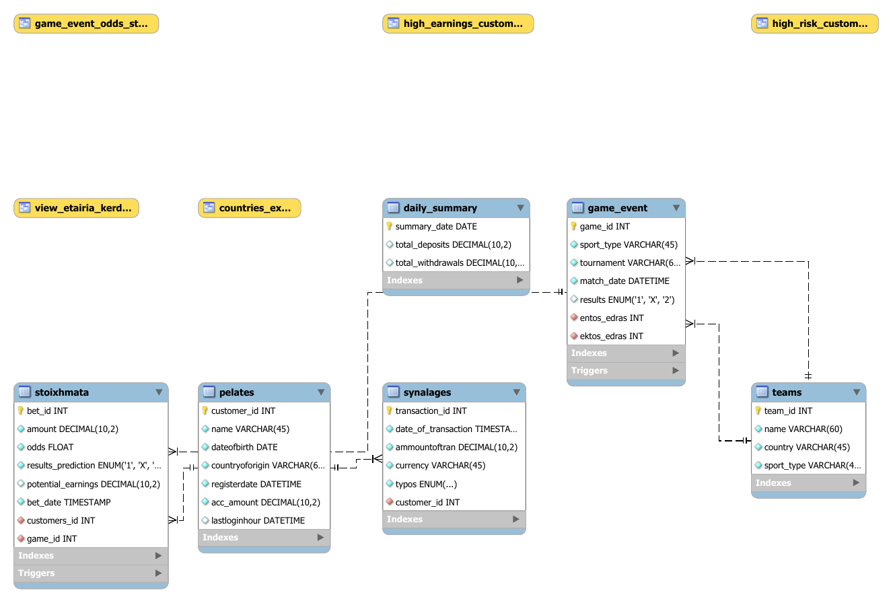

# SQL Betting Analytics Database

A relational database project modelling a **sports-betting platform** in MySQL, built around real transactional integrity rather than just `SELECT` queries. It combines schema design, triggers, stored routines, a scheduled event, analytical views, and a small Python/Excel reporting layer.

The domain: customers deposit money, place bets on football/basketball games, and the house settles those bets when results come in. The database enforces the rules of that flow.

---

## What this project demonstrates

- **Normalized schema** with foreign keys, enums, and a generated column
- **Triggers** that enforce balance integrity (stake validation + automated win settlement)
- **Stored function & procedure** for profit/loss analysis
- **Scheduled event** that aggregates daily deposits/withdrawals
- **Analytical views** for risk, profitability, and reporting
- **Python + Excel layer** that segments customers with KMeans

---

## Entity–Relationship Diagram



Six tables model the platform:

| Table | Role |
|-------|------|
| `pelates` | Customers (name, country, account balance `acc_amount`) |
| `teams` | Teams, by sport |
| `game_event` | Games, with the final `results` enum `('1','X','2')` |
| `stoixhmata` | Bets (stake, odds, prediction, `potential_earnings`) |
| `synalages` | Transactions (deposits, withdrawals, bet movements) |
| `daily_summary` | Daily aggregate of deposits/withdrawals |

A nice detail in `stoixhmata`: `potential_earnings` is a **generated column** (`amount * odds`, `STORED`), so payout is always consistent with stake and odds and never has to be maintained by hand.

---

## Business logic (the interesting part)

### Triggers — balance integrity
See [`sql/logic/triggers.sql`](sql/logic/triggers.sql).

- **`check_balance_before_bet`** (BEFORE INSERT on `stoixhmata`): rejects non-positive stakes, rejects bets the customer can't afford (raising a custom `SIGNAL SQLSTATE '45000'` error), and **debits the stake** from the account in the same step. A bet can never push a balance negative.
- **`update_winners_balance`** (AFTER UPDATE on `game_event`): the moment a game's result is set for the first time (`NULL → '1'/'X'/'2'`), every matching bet is **settled automatically** and winners are credited their `potential_earnings`.

Together these make bet placement and settlement atomic and self-consistent at the database level.

### Routines & event
See [`sql/logic/routines.sql`](sql/logic/routines.sql).

- **`get_profit_or_loss(start, end, customer_id)`** — function returning a customer's net P&L over a date range (winnings minus stakes on settled games).
- **`top_k_profitable_games(start, end, k)`** — procedure returning the *k* most profitable games **from the house's perspective**.
- **`calculate_daily_summary`** — a scheduled event that rolls the previous day's deposits/withdrawals into `daily_summary` (idempotent).

### Analytical views
See [`sql/logic/views.sql`](sql/logic/views.sql).

| View | What it surfaces |
|------|------------------|
| `high_risk_customers` | Customers whose average odds exceed 2 |
| `high_earnings_customers` | Customers earning above the average customer profit |
| `view_etairia_kerdos` | Company profit/loss per game & prediction |
| `game_event_odds_stats` | Max/min offered odds per game |
| `countries_excel` | Deposits/withdrawals aggregated by country (feeds Excel) |

---

## Python / Excel reporting

[`notebooks/customer_segmentation.ipynb`](notebooks/customer_segmentation.ipynb) connects to the database, pulls per-customer betting statistics, and uses the **Elbow method + KMeans** to segment customers into behavioural profiles (High Roller, Risky Player, Low Stake, Casual Bettor), exporting the result to Excel. An example aggregate export is in [`reports/`](reports/).

---

## Repository structure

```text
sql-betting-analytics/
├── README.md
├── .gitignore
├── sql/
│   ├── mathbet_dump.sql          # full runnable MySQL dump (schema + data + logic)
│   └── logic/                    # readable extracts of the key logic
│       ├── triggers.sql
│       ├── routines.sql
│       └── views.sql
├── diagram/
│   ├── eer_diagram.png
│   └── eer_diagram.pdf
├── notebooks/
│   └── customer_segmentation.ipynb
└── reports/
    └── countries_deposits_withdrawals.xlsx
```

The files under `sql/logic/` are reformatted, comment-rich copies of objects that already live inside `mathbet_dump.sql`; they exist purely so the interesting logic is easy to read on its own.

---

## How to run

**1. Restore the database** (creates the schema, loads sample data, installs triggers/routines/views):

```bash
mysql -u root -p < sql/mathbet_dump.sql
```

This creates a database called `mathbet`. Sample data loads before the triggers are installed (standard mysqldump ordering), so the triggers don't fire on the seed rows.

**2. Enable the scheduled event** (optional, for the daily summary):

```sql
SET GLOBAL event_scheduler = ON;
```

**3. Try the logic:**

```sql
-- a customer's net P&L over a date range
SELECT get_profit_or_loss('2025-04-01', '2025-04-30', 1);

-- the 3 most profitable games for the house
CALL top_k_profitable_games('2025-04-01', '2025-04-30', 3);

-- company P&L per game
SELECT * FROM view_etairia_kerdos;
```

**4. Run the Python segmentation** (set your password in the environment first):

```bash
export MYSQL_PASSWORD=yourpassword      # Windows: setx MYSQL_PASSWORD yourpassword
pip install mysql-connector-python pandas scikit-learn matplotlib seaborn openpyxl
jupyter notebook notebooks/customer_segmentation.ipynb
```

---

## Tech stack

- **MySQL 8** — schema, triggers, stored function/procedure, scheduled event, views, generated column
- **Python** — Pandas, scikit-learn (KMeans), Matplotlib/Seaborn
- **Excel** — reporting output

---

## Notes

- The data is small synthetic seed data created for the project; it contains no real personal information.
- Some object and column names are in Greek/Greeklish (`pelates` = customers, `stoixhmata` = bets, `synalages` = transactions, `view_etairia_kerdos` = company profit).

## Author

Markos Pantelis
